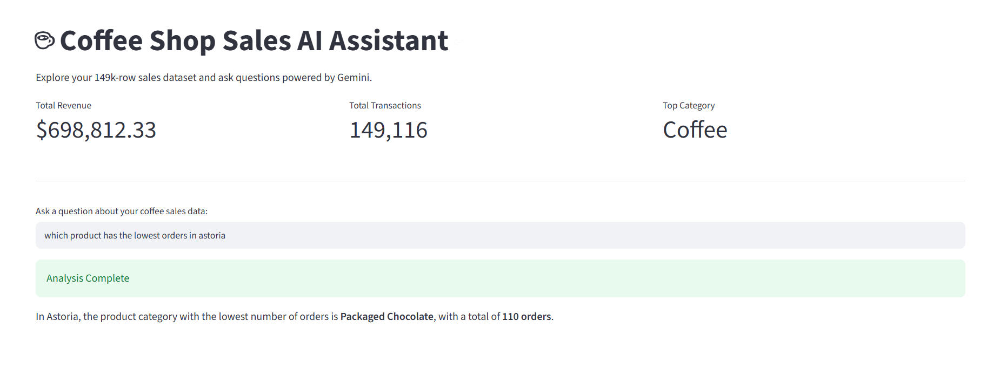
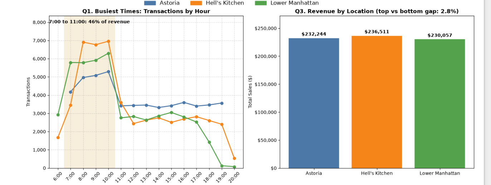

# Coffee Shop Sales AI Assistant ☕🤖
An AI-powered data assistant built with Python, Streamlit, and Matplotlib that interacts with retail transaction data to answer natural language queries about coffee shop sales performance.

## 📊 App Preview & Visualizations

### 1. Interactive Web Interface
Users can query sales logs dynamically through natural language, backed by a structured data cleaning and processing pipeline powered by the Gemini API.



### 2. Exploratory Data Analysis (Matplotlib)
Automated charts breaking down peak transaction hours (highlighting that **7:00 to 11:00 accounts for 46% of revenue**) and location-based revenue comparisons across Astoria, Hell's Kitchen, and Lower Manhattan.



## 🚀 Features
* **Natural Language Queries:** Ask plain-English questions about your 149k-row sales dataset.
* **Dynamic Streamlit Dashboard:** Instant feedback, KPI summaries, and responsive UI components.
* **Statistical Visualizations:** Custom Matplotlib charts analyzing hourly trends and regional revenue distribution.

## 🛠️ Tech Stack
* **Core & Analysis:** Python, Pandas, NumPy
* **App Interface:** Streamlit
* **Data Visualization:** Matplotlib
* **AI & NLP:** Google Generative AI (`google-generativeai`)
* **Utilities & Environment:** `python-dotenv` (for API key management)

## ⚙️ Getting Started
1. Clone the repository:
   ```bash
   git clone [https://github.com/WAWERU123/coffee-shop-ai-assistant.git](https://github.com/WAWERU123/coffee-shop-ai-assistant.git)
